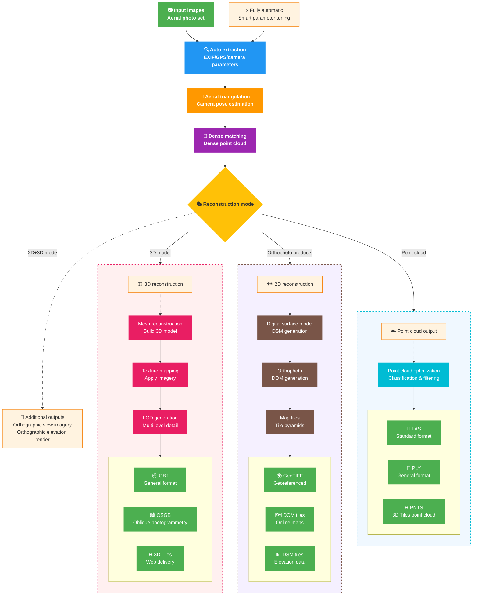

## Basic Concepts

Before using MipMapEngine SDK, understanding a few core concepts will help you work more effectively. This chapter introduces 3D reconstruction fundamentals in plain language.

*If you are an experienced photogrammetry professional or want API details directly, you may skip this chapter and read [Full-pipeline reconstruction](../basic/reconstruct-full).*

### What Is 3D Reconstruction?

3D reconstruction is the process of creating a 3D model from 2D images. Imagine you take many photos around a building; photogrammetry and reconstruction technology can:

1. Analyze relationships between the photos
2. Compute the camera position for each exposure
3. Derive 3D information for corresponding pixels from camera pose and image texture
4. Represent object or scene geometry as a point cloud or mesh
5. Apply textures from the source images to build a realistic 3D model

:::tip Applications of 3D reconstruction

- **Surveying and mapping**: High-accuracy topographic maps and orthophotos
- **Urban planning**: City-scale 3D models for design and planning
- **Cultural heritage**: Digital preservation of historic buildings and artifacts
- **Emergency response**: Rapid 3D capture of disaster scenes
- **Construction monitoring**: Track progress and change on engineering projects
- **3D content production**: Assets for games, film, AR/VR

:::

### Photogrammetry Fundamentals

#### 3D Reconstruction Pipeline



:::tip Pipeline characteristics
- **🚀 Fully automatic**: End-to-end processing from input to output without manual steps
- **🎯 Smart decisions**: Automatically selects optimal parameters from data characteristics
- **📦 Multiple formats**: Generate several formats in one run for different applications
- **⚡ Parallel optimization**: Output branches can be processed in parallel for higher throughput
:::

:::tip Output selection guide
- **Web visualization**: 3D Tiles + DOM tiles
- **Professional analysis**: OSGB + GeoTIFF + LAS
- **General interchange**: OBJ + PLY
- **Surveying / mapping**: GeoTIFF + DSM + ground control optimization
:::

#### Aerial Triangulation

**Aerial triangulation (AT)** is the first step in 3D reconstruction. It:

- Computes the precise position and orientation of the camera for each image
- Establishes geometric relationships between images
- Builds a sparse point cloud structure of the scene

#### Dense Reconstruction

Once camera poses are known:

- Depth is computed for each pixel
- A dense 3D point cloud is generated

#### 3D Model Reconstruction

- Build a 3D mesh from the point cloud
- Create model textures from the original images
- Generate LOD models for efficient rendering of large scenes

#### Deliverable Formats

Finally, produce the outputs you need:

- **3D models**: OSGB, 3D Tiles, PLY, OBJ, FBX, and more
- **Point clouds**: LAS, PLY
- **Gaussian splats**: PLY, Splats
- **Orthophotos**: Georeferenced GeoTIFF imagery
- **Digital surface model (DSM)**: Terrain / surface elevation data

#### Standard Output Directory Layout

Every reconstruction task produces this standard layout:

```
output/
├── 2D/
│   ├── dom_tiles/      # Orthophoto tiles
│   ├── dsm_tiles/      # DSM tiles
│   └── geotiffs/       # GeoTIFF deliverables
├── 3D/
│   ├── model-b3dm/     # 3D Tiles model format
│   ├── model-osgb/     # OSGB model format
│   ├── model-ply/      # PLY model format
│   ├── model-obj/      # OBJ model format
│   ├── model-fbx/      # FBX model format
│   ├── point-ply/      # PLY point cloud
│   ├── point-las/      # LAS point cloud
│   ├── point-pnts/     # PNTS point cloud
│   ├── point-gs-ply/   # PLY Gaussian splat format
│   └── point-gs-splats/# SPLATS Gaussian splat format
├── AT/
│   ├── mvs.xml         # AT results
│   └── mvs_undistort.xml # Undistorted AT results
├── report/
│   └── report.json     # Quality report
└── log.txt             # Processing log
```

#### Output Format Reference

| Format | Use case | Characteristics |
|------|------|------|
| **3D Tiles** | Web visualization | LOD support; suited for Cesium and similar platforms |
| **OSGB** | Professional software | OpenSceneGraph format; widely supported |
| **OBJ** | General 3D models | Simple, universal, easy to edit |
| **LAS** | Point cloud workflows | Standard point cloud format with classification |
| **GeoTIFF** | GIS analysis | Georeferenced; suitable for measurement |
| **Tiles** | Online maps | Multi-resolution pyramids for fast loading |


### Key Parameters

#### Resolution Level

Controls reconstruction detail:

| Level | Description | Use case | Processing time |
|------|------|----------|----------|
| 1 | Ultra-high: maximum geometric detail and texture sharpness | Professional surveying, fine modeling | Longer |
| 2 | High: some geometric simplification; maximum texture sharpness | General production, faster delivery | Medium |
| 3 | Low | Preview, quick validation | Shorter |

#### Image Overlap

<svg viewBox="0 0 800 300" xmlns="http://www.w3.org/2000/svg">
  <!-- Background -->
  <rect width="800" height="300" fill="#f8f9fa" stroke="none"/>
  
  <!-- Title -->
  <text x="400" y="30" text-anchor="middle" font-size="18" font-weight="bold" fill="#333">Ideal image overlap</text>
  
  <!-- Image 1 -->
  <rect x="100" y="80" width="150" height="100" fill="#2196F3" opacity="0.6" stroke="#1976D2" stroke-width="2"/>
  <text x="175" y="130" text-anchor="middle" fill="white" font-size="14" font-weight="bold">Image 1</text>
  
  <!-- Image 2 -->
  <rect x="200" y="80" width="150" height="100" fill="#4CAF50" opacity="0.6" stroke="#388E3C" stroke-width="2"/>
  <text x="275" y="130" text-anchor="middle" fill="white" font-size="14" font-weight="bold">Image 2</text>
  
  <!-- Image 3 -->
  <rect x="300" y="80" width="150" height="100" fill="#FF9800" opacity="0.6" stroke="#F57C00" stroke-width="2"/>
  <text x="375" y="130" text-anchor="middle" fill="white" font-size="14" font-weight="bold">Image 3</text>
  
  <!-- Overlap annotation -->
  <path d="M 200 200 L 200 180" stroke="#333" stroke-width="1" stroke-dasharray="2,2"/>
  <path d="M 250 200 L 250 180" stroke="#333" stroke-width="1" stroke-dasharray="2,2"/>
  <text x="225" y="220" text-anchor="middle" font-size="12" fill="#666">60–80% overlap</text>
  
  <!-- Caption -->
  <text x="400" y="260" text-anchor="middle" font-size="14" fill="#333">Recommended: 60–80% forward overlap, 40–60% side overlap</text>
</svg>

### Quality Control

#### Factors That Affect Reconstruction Quality

1. **Image quality**
   - Sharpness (avoid motion blur)
   - Lighting (even illumination is best)

2. **Acquisition parameters**
   - Overlap (>70%)
   - Flight altitude (affects ground sample distance, GSD)
   - Viewing angles (nadir + oblique combinations work best)

3. **Typical accuracy without ground control**
   - RTK/PPK: centimeter-level (1–2 cm + 1–2× GSD)
   - Standard GPS: meter-level

### Best Practices for Reconstruction Accuracy

**Reliable accuracy**: RTK and PPK workflows without ground control often achieve good results, but ground control points (GCPs) and check points remain the most reliable way to guarantee and verify accuracy. If your application must meet a strict accuracy target, or project delivery requires documented proof of accuracy, deploy GCPs and check points. Otherwise you risk costly re-flight and re-collection in the field.

