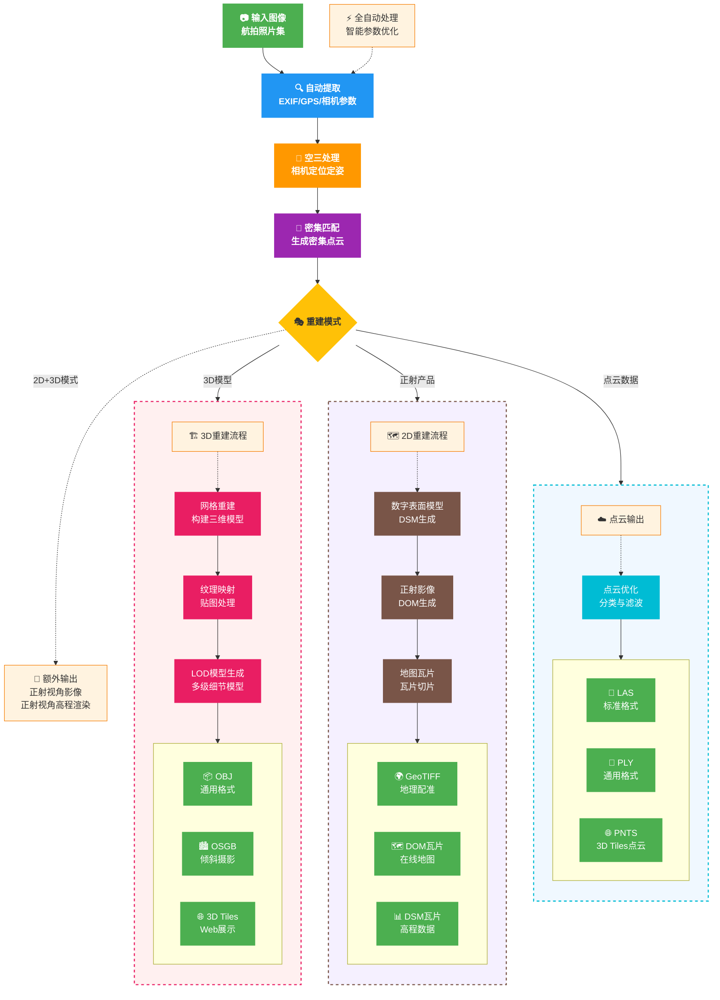

## 基本概念

在开始使用 MipMapEngine SDK 之前，理解一些核心概念将帮助您更好地使用。本章节将用通俗易懂的方式介绍三维重建的基础知识。

*如果您是专业资深的摄影测量从业者，或想直接了解API相关知识，可跳过此章节，阅读： [全流程重建](../basic/reconstruct-full)*

### 什么是三维重建

三维重建是从二维图像创建三维模型的过程。想象一下，您围绕一个建筑物拍摄了多张照片，三维重建技术能够：

1. 分析这些照片之间的关系
2. 计算出拍摄时相机的位置
3. 根据相机的位置和纹理计算出对应像素的三维信息
4. 将物体或场景的三维几何信息以点云或者Mesh的形式的表达
5. 基于照片的纹理为模型添加的纹理，构建逼真的三维模型

:::tip 三维重建的应用场景

- **测绘制图**：生成高精度地形图和正射影像
- **城市规划**：创建城市三维模型用于规划设计
- **文物保护**：数字化保存历史建筑和文物
- **应急响应**：快速获取灾害现场三维信息
- **工程监测**：监测建筑工程进度和变化
- **3D内容资产生成**：生成游戏、影视、AR/VR的3D内容资产

:::

### 摄影测量基础

#### 三维重建流程详解



:::tip 处理流程特点
- **🚀 全自动化**：从输入到输出全程自动处理，无需人工干预
- **🎯 智能决策**：根据数据特征自动选择最佳处理参数
- **📦 多格式输出**：支持同时生成多种格式，满足不同应用需求
- **⚡ 并行优化**：多个输出分支可并行处理，提高效率
:::

:::tip 输出选择建议
- **Web展示**：选择 3D Tiles + DOM瓦片
- **专业分析**：选择 OSGB + GeoTIFF + LAS
- **通用交换**：选择 OBJ + PLY
- **测绘应用**：选择 GeoTIFF + DSM + 控制点优化
:::

#### 空中三角测量

**空三**是三维重建的第一步，它的任务是：
- 计算每张照片拍摄时相机的精确位置和姿态
- 建立照片之间的几何关系
- 生成场景的稀疏点云结构

#### 密集重建

有了相机位置后：
- 对每个像素进行深度计算
- 生成密集的三维点云

#### 三维模型重建

- 由点云构建三维网格模型
- 从原始图像创建模型纹理
- 生成便于大规模场景渲染的LOD模型

#### 不同格式的成果生成

最后，根据您的需求生成不同的成果：
- **三维模型**：OSGB、3D Tiles、PLY、OBJ、FBX 等格式
- **点云数据**：LAS、PLY 格式
- **高斯泼溅数据**：PLY、Splats 格式
- **正射影像**：GeoTIFF 格式的地理配准影像
- **数字表面模型（DSM）**：地形高程数据

#### 标准输出目录结构

所有重建任务都会生成以下标准输出：

```
output/
├── 2D/
│   ├── dom_tiles/      # 正射影像瓦片
│   ├── dsm_tiles/      # 数字表面模型瓦片
│   └── geotiffs/       # GeoTIFF 格式成果
├── 3D/
│   ├── model-b3dm/     # 3D Tiles 模型格式
│   ├── model-osgb/     # OSGB 模型格式
│   ├── model-ply/      # PLY 模型格式
│   ├── model-obj/      # OBJ 模型格式
│   ├── model-fbx/      # FBX 模型格式
│   ├── point-ply/      # PLY 点云格式
│   ├── point-las/      # LAS 点云格式
│   ├── point-pnts/     # PNTS 点云格式
│   ├── point-gs-ply/   # PLY 高斯泼溅格式
│   └── point-gs-splats/# SPLATS 高斯泼溅格式
├── AT/
│   ├── mvs.xml         # 空三结果
│   └── mvs_undistort.xml # 去畸变后的空三结果
├── report/
│   └── report.json     # 质量报告
└── log.txt             # 处理日志
```

#### 输出格式说明

| 格式 | 用途 | 特点 |
|------|------|------|
| **3D Tiles** | Web展示 | 支持LOD，适合Cesium等平台 |
| **OSGB** | 专业软件 | OpenSceneGraph格式，广泛支持 |
| **OBJ** | 通用模型 | 简单通用，易于编辑 |
| **LAS** | 点云处理 | 标准点云格式，包含分类信息 |
| **GeoTIFF** | GIS分析 | 带地理坐标，可用于测量 |
| **瓦片** | 在线地图 | 多级切片，快速加载 |


### 关键参数解释

#### 分辨率等级（Resolution Level）

控制重建的精细程度：

| 等级 | 说明 | 使用场景 | 处理时间 |
|------|------|----------|----------|
| 1 | 超高精度，几何细节和纹理清晰度均为最高 | 专业测绘、精细建模 | 较长 |
| 2 | 高精度，一定程度的简化几何细节，纹理清晰度为最高 | 一般应用、快速成果 | 中等 |
| 3 | 低精度 | 预览、快速验证 | 较短 |

#### 图像重叠度

<svg viewBox="0 0 800 300" xmlns="http://www.w3.org/2000/svg">
  <!-- 背景 -->
  <rect width="800" height="300" fill="#f8f9fa" stroke="none"/>
  
  <!-- 标题 -->
  <text x="400" y="30" text-anchor="middle" font-size="18" font-weight="bold" fill="#333">理想的图像重叠度</text>
  
  <!-- 图像1 -->
  <rect x="100" y="80" width="150" height="100" fill="#2196F3" opacity="0.6" stroke="#1976D2" stroke-width="2"/>
  <text x="175" y="130" text-anchor="middle" fill="white" font-size="14" font-weight="bold">图像 1</text>
  
  <!-- 图像2 -->
  <rect x="200" y="80" width="150" height="100" fill="#4CAF50" opacity="0.6" stroke="#388E3C" stroke-width="2"/>
  <text x="275" y="130" text-anchor="middle" fill="white" font-size="14" font-weight="bold">图像 2</text>
  
  <!-- 图像3 -->
  <rect x="300" y="80" width="150" height="100" fill="#FF9800" opacity="0.6" stroke="#F57C00" stroke-width="2"/>
  <text x="375" y="130" text-anchor="middle" fill="white" font-size="14" font-weight="bold">图像 3</text>
  
  <!-- 重叠区域标注 -->
  <path d="M 200 200 L 200 180" stroke="#333" stroke-width="1" stroke-dasharray="2,2"/>
  <path d="M 250 200 L 250 180" stroke="#333" stroke-width="1" stroke-dasharray="2,2"/>
  <text x="225" y="220" text-anchor="middle" font-size="12" fill="#666">60-80% 重叠</text>
  
  <!-- 说明文字 -->
  <text x="400" y="260" text-anchor="middle" font-size="14" fill="#333">推荐：航向重叠 60-80%，旁向重叠 40-60%</text>
</svg>

### 质量控制

#### 影响重建质量的因素

1. **图像质量**
   - 清晰度（避免模糊）
   - 光照条件（均匀光照最佳）

2. **拍摄参数**
   - 重叠度（>70%）
   - 飞行高度（影响地面分辨率）
   - 拍摄角度（垂直+倾斜组合最佳）

3. **典型的免像控精度**
   - RTK/PPK：厘米级精度（1~2cm + 1~2*GSD）
   - 普通 GPS：米级精度

### 重建精度的最佳实践

**可靠的重建精度**：RTK和PPK免相控方案大多数时候能够达到不错的精度，但控制点与检查点仍然是最可靠的精度保证和验证方法，如果你的应用要100%的保证精度目标达成，或者项目交付需要提供充分的证据佐证成果的精度，务必布设控制点/检查点，否则你可能面临外业数据采集返工。

